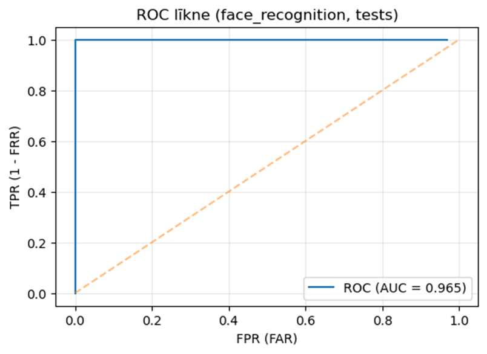
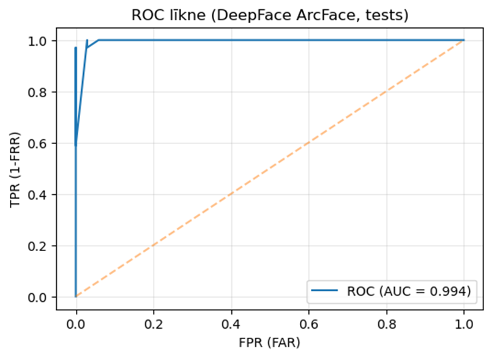
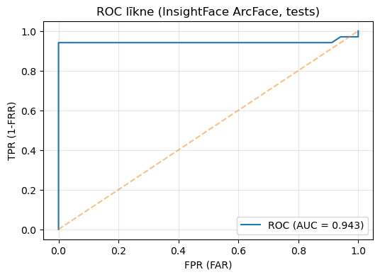

# 🧠 Atvērtā koda sejas atpazīšanas sistēmu analīze kontrolētos apstākļos

Šis projekts ir **bakalaura darba** pētnieciskā daļa, kurā salīdzinātas atvērtā koda sejas atpazīšanas sistēmas kontrolētos apstākļos.  
Mērķis — novērtēt trīs populāras bibliotēkas: `face_recognition`, `DeepFace` un `InsightFace`, analizējot **izpildes laiku, caurlaidspēju (FPS), precizitāti, kļūdu līmeni (FAR/FRR), CPU un RAM izmantošanu**.

---

## 🎯 Mērķis

- Salīdzināt `face_recognition`, `DeepFace` un `InsightFace` **1:1 verifikācijas** uzdevumā (vai divi attēli pieder vienai personai).  
- Identificēt katras sistēmas **stiprās/vājās puses** un piedāvāt **hibrīdrisinājuma** ideju, apvienojot priekšrocības.

---

## 🧩 Izmantotās sistēmas un atsauces

| Sistēma | Dokumentācija / GitHub | Modelis | Detektora backend |
|---|---|---|---|
| **face_recognition** | [ageitgey/face_recognition](https://github.com/ageitgey/face_recognition) | HOG + Dlib CNN | Dlib |
| **DeepFace** | [serengil/deepface](https://github.com/serengil/deepface) | VGG-Face | MTCNN / Dlib |
| **InsightFace** | [deepinsight/insightface](https://github.com/deepinsight/insightface) | ArcFace (ResNet100) | RetinaFace |

**Konfigurāciju kopsavilkums:**

| Posms | face_recognition | DeepFace | InsightFace |
|---|---|---|---|
| Detektors | CNN | MTCNN | RetinaFace |
| Izlīdzināšana | 68 atslēgpunkti | 5 atslēgpunkti | 5 atslēgpunkti |
| Iegultnes | ResNet-34, 128D | ArcFace, 512D | ArcFace, 512D |
| Līdzības mērs | Eiklīda attālums | Kosinuss | Kosinuss |

> Visas sistēmas testētas ar **vienādu datu kopu** un **identisku eksperimenta struktūru**, nodrošinot objektīvu salīdzinājumu.

---

## ⚙️ Tehnoloģijas

- **Python 3.10**
- **OpenCV**, **Dlib**, **NumPy**, **Pandas**, **Psutil**
- **face_recognition**, **DeepFace**, **InsightFace**
- **Windows 10** / **WSL2 (Ubuntu 22.04)**
- **Jupyter Notebook** (analīzei un grafiku veidošanai)

---

## 🗂️ Projekta struktūra

```plaintext
bakalaura_darbs/
│
├── face_recognition/
│   ├── Face_recognition_kods.py
│   ├── dataset/
│   │   ├── train/
│   │   └── test/
│
├── DeepFace/
│   ├── DeepFace_kods.py
│   ├── dataset/
│   │   ├── train/
│   │   └── test/
│
├── InsightFace/
│   ├── InsightFace_kods.py
│   ├── dataset/
│   │   ├── train/
│   │   └── test/
│
├── summary/
│   ├── roc_curves.png            # ROC līknes
│   └── comparison_charts.png     # Salīdzinājuma diagrammas
│
└── README.md
````

## 📊 Metodika

Eksperimenti veikti ar **10 personu datu kopu**.  
Katram cilvēkam izmantoti **treniņu (`train`)** un **testēšanas (`test`)** attēli.

Tika mērīti sekojoši **kritēriji**:

| Kritērijs | Apraksts |
|------------|-----------|
| **Precizitāte (Accuracy)** | Pareizi atpazīto pāru īpatsvars |
| **FAR (False Acceptance Rate)** | Nepareizi akceptēto pāru īpatsvars |
| **FRR (False Rejection Rate)** | Nepareizi noraidīto pāru īpatsvars |
| **EER (Equal Error Rate)** | Punkts, kur FAR = FRR |
| **AUC (ROC)** | ROC līknes laukums (modeļa kopējā kvalitāte) |
| **Izpildes laiks (ms/pāris)** | Vidējais laiks vienam pāra salīdzinājumam |
| **Caurlaidspēja (FPS)** | Apstrādāto pāru skaits sekundē |
| **CPU (%)** | Vidējais procesora noslogojums |
| **RAM (MB)** | Vidējais operatīvās atmiņas patēriņš |

---

## 📷 Datu kopa

**Personu sadalījums apmācībai un testēšanai (piemērs):**

| Persona | Treniņattēli | Validācijas | Testattēli | Kopā |
|----------|---------------|--------------|-------------|-------|
| person1 | 2 | 1 | 1 | 4 |
| person2 | 3 | 1 | 1 | 5 |
| person3 | 11 | 3 | 4 | 18 |
| person4 | 12 | 4 | 4 | 20 |
| person5 | 13 | 4 | 4 | 21 |
| person6 | 9 | 3 | 3 | 15 |
| person7 | 9 | 3 | 3 | 15 |
| person8 | 9 | 3 | 3 | 15 |
| person9 | 13 | 4 | 5 | 22 |
| person10 | 15 | 5 | 5 | 25 |

---

**Izmantotās attēlu kopas:**
- [Object Detection – Obama Dataset (Kaggle)](https://www.kaggle.com/datasets/jipingsun/object-detection-obama)
- [Caltech-101 Object Categories (Kaggle)](https://www.kaggle.com/datasets/imbikramsaha/caltech-101)
- [Occluded and Masked Face Dataset (Mendeley)](https://data.mendeley.com/datasets/znpyrgbfdr/1)
- [Face Recognition Dataset (Stanford University)](https://www.stanford.edu)

---

## 📈 Rezultāti *(aizstāj ar saviem faktiskajiem datiem)*

### 🟦 face_recognition
| Kritērijs | Rezultāts (vid.) |
|------------|------------------|
| Precizitāte | 97.5% |
| FAR | 0.0% |
| FRR | 2.5% |
| AUC (ROC) | 0.965 |
| Izpildes laiks (ms) | 0.32 ± 0.05 |
| FPS | 3.4 |
| RAM (MB) | ~248 |
| CPU (%) | 4.2 ± 2.0 |

---

### 🟩 DeepFace
| Kritērijs | Rezultāts (vid.) |
|------------|------------------|
| Precizitāte | 100.0% |
| FAR | 0.0% |
| FRR | 2.5% |
| AUC (ROC) | 0.944 |
| Izpildes laiks (ms) | 0.42 ± 0.04 |
| FPS | 2.7 |
| RAM (MB) | ~385 |
| CPU (%) | 2.7 ± 1.0 |

---

### 🟧 InsightFace
| Kritērijs | Rezultāts (vid.) |
|------------|------------------|
| Precizitāte | 96.0% |
| FAR | 0.0% |
| FRR | 4.0% |
| AUC (ROC) | 0.943 |
| Izpildes laiks (ms) | 0.34 ± 0.07 |
| FPS | 5.1 |
| RAM (MB) | ~632 |
| CPU (%) | 6.3 ± 4.0 |

---

## 📊 Grafiskā analīze

## 📈 ROC līknes

ROC (Receiver Operating Characteristic) līknes ilustrē katras sistēmas jutības un specifiskuma līdzsvaru.

| Sistēma | ROC līkne |
|----------|------------|
| **face_recognition** |  |
| **DeepFace** |  |
| **InsightFace** |  |

---

## 🧾 Atsauces

1. Deng, J., Guo, J., An, X., Zafeiriou, S. (2021). *Masked Face Recognition Challenge: The InsightFace Track Report.* arXiv.  
2. Taigman, Y., Yang, M., Ranzato, M. A., Wolf, L. (2014). *DeepFace: Closing the Gap to Human-Level Performance in Face Verification.* CVPR.  
3. Geitgey, A. (2018). *face_recognition Python Library.* GitHub.  
4. Serengil, S. (2020). *DeepFace: A Lightweight Face Recognition Framework for Python.* GitHub.  
5. DeepInsight (2020). *InsightFace: Deep Face Analysis Toolkit.* GitHub.

